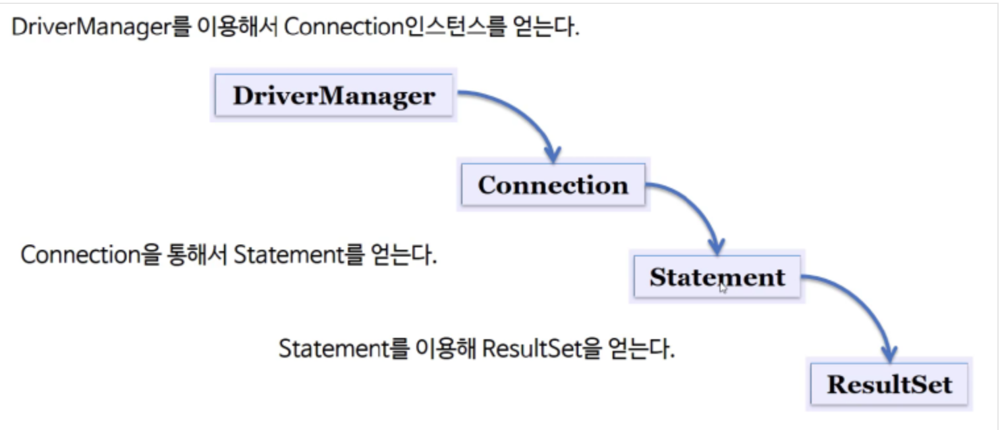
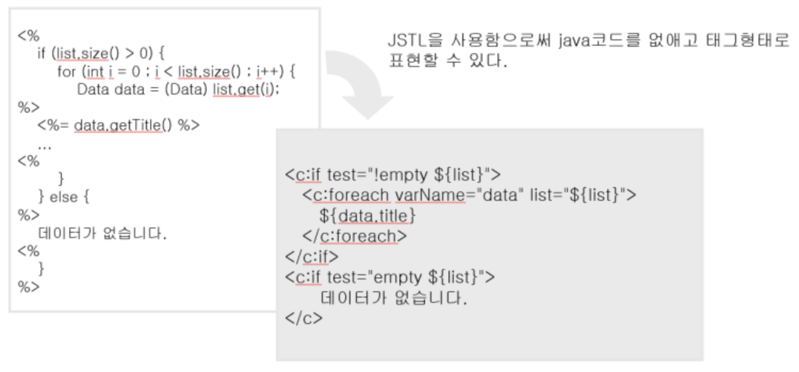
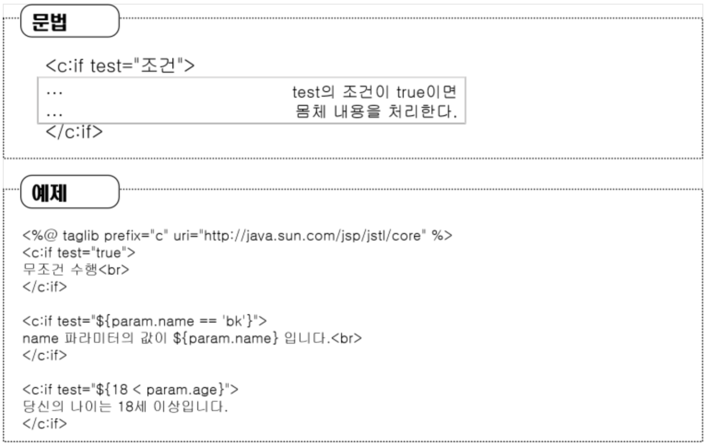
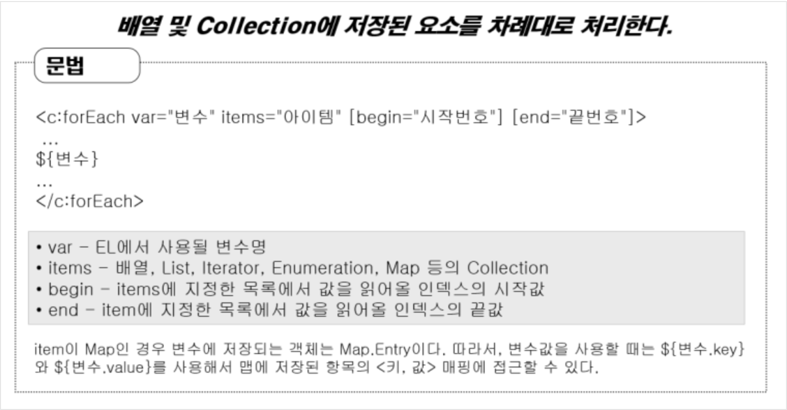
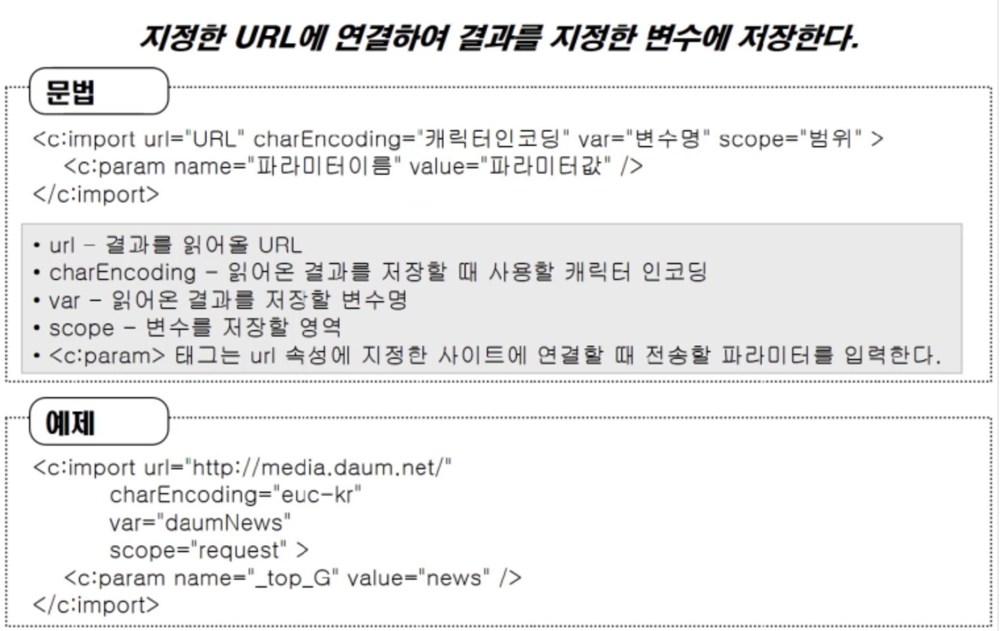
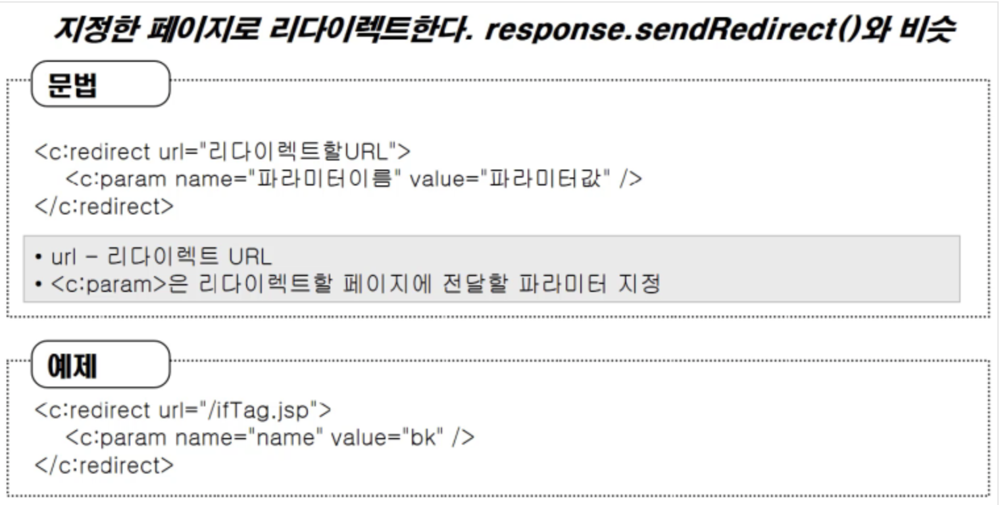
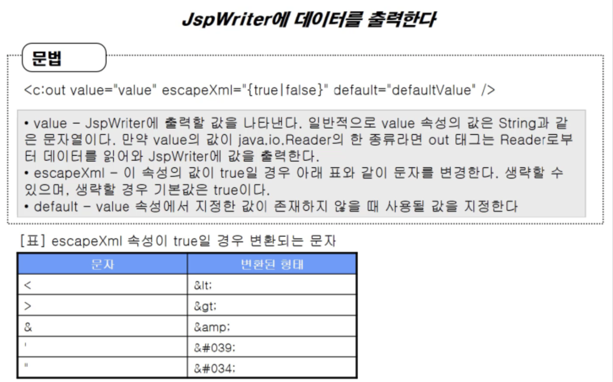

#### 최초 작성일 : 2021.08.01(일)

# Boostcourse Java Back-end 과정 학습

여기서는 Boostcourse Java Back-end 개발 학습을 진행한다.

## 학습 환경

1. OS : MacOS
2. JDK : Oracle JDK 1.8
4. Build Tools : Maven
5. Database : MySQL
6. IDE: IntelliJ IDEA Ultimate

## Maven이란?

1. Maven은 지금까지 애플리케이션을 개발하기 위해 반복적으로 진행해왔던 작업들을 지원하기 위하여 등장한 도구이다.
2. Maven을 사용하면 `빌드(Build), 패키징, 문서화, 테스트와 테스트 리포팅, git, 의존성관리, svn등과 같은 형상관리서버와 연동(SCMs), 배포` 등의 작업을 손쉽게 할 수 있다.
3. `CoC(Convention over Configuration)`
    - CoC란 일종의 관습을 말하는데, 예를 들자면 프로그램의 소스파일은 어떤 위치에 있어야 하고, 소스가 컴파일된 파일들은 어떤 위치에 있어야 하고 등을 미리 정해 놓은 것이다.
    - 이 말은 관습에 이미 익숙한 사용자는 쉽게 Maven을 사용할 수 있는데, 관습에 익숙하지 않은 사용자는 이러한 제약사항에 대해서 심한 거부감을 느낄 수 있다.

### Maven의 이점

1. 가장 큰 장점 중에는 편리한 의존성 라이브러리 관리가 있다.
    - Maven을 사용하면 `설정 파일(pom.xml)`에 몇 줄 적어줌으로써 직접 다운로드 받거나 하는 것을 하지 않아도 라이브러리를 사용할 수 있다.
2. 모든 개발자가 일관된 방식으로 빌드를 수행할 수 있다.
3. 또한 다양한 플러그인을 제공해줘서, 굉장히 많은 일들을 자동화시킬 수 있다.

### Maven 설정 파일 알아보기

1. `Archetype`을 이용하여 Maven 기반 프로젝트를 생성할 경우 생성된 프로젝트 하위에 다음과 같이 `pom.xml` 파일이 생성된다.

```xml

<project xmlns="http://maven.apache.org/POM/4.0.0"
         xmlns:xsi="http://www.w3.org/2001/XMLSchema-instance"
         xsi:schemaLocation="http://maven.apache.org/POM/4.0.0 
                             http://maven.apache.org/maven-v4_0_0.xsd">
    <modelVersion>4.0.0</modelVersion>
    <groupId>kr.or.connect</groupId>
    <artifactId>examples</artifactId>
    <packaging>jar</packaging>
    <version>1.0-SNAPSHOT</version>
    <name>mysample</name>
    <url>http://maven.apache.org</url>
    <dependencies>
        <dependency>
            <groupId>junit</groupId>
            <artifactId>junit</artifactId>
            <version>3.8.1</version>
            <scope>test</scope>
        </dependency>
    </dependencies>
</project>

```

2. 각 태그의 의미
    - project: pom.xml 파일의 최상위 루트 엘리먼트(Root Element).
    - modelVersion: POM model의 버전.
    - groupId: 프로젝트를 생성하는 조직의 고유 아이디.
        - 일반적으로 도메인 이름을 거꾸로 적음
    - artifactId: 해당 프로젝트에 의하여 생성되는 Artifact의 고유 아이디.
        - Maven을 이용하여 pom.xml을 빌드할 경우 다음과 같이 `{artifactid}-{version}.{packaging}`의 규칙으로 Artifact가 생성된다.
        - 위 예제 코드의 경우 examples-1.0-SNAPSHOT.jar Artifact 파일이 생성될 것이다.
    - packaging: 해당 프로젝트를 어떤 형태로 packaging 할 것인지 결정한다.
        - jar, war, ear 등
    - version: 프로젝트의 현재 버전.
        - 추후 살펴보겠지만 프로젝트가 개발 중일 때는 SNAPSHOT을 접미사로 사용한다.
    - name: 프로젝트의 이름.
    - url: 프로젝트 사이트가 있다면 사이트 URL을 등록하는 것이 가능하다.
    - dependencies:  Dependency Management 기능의 핵심이며, 해당 엘리먼트 안에 필요한 라이브러리를 지정해서 사용한다.

## Maven 프로젝트 생성

1. IntelliJ에서 New Project 선택
   
2. `Maven` 선택, `org.apache.maven.archetypes:maven-archetype-webapp` 선택 후 Next 버튼 클릭
   
3. `GroupId`, `ArtifactId`, `Version` 설정 후 Next 버튼 클릭
   
    - GroupId는 보통 프로젝트를 진행하는 회사나 팀의 도메인 이름을 거꾸로 적는다.
    - ArtifactId는 해당 프로젝트의 이름을 적는다.
    - Version은 보통 기본값(1.0-SNAPSHOT)으로 설정한다.
    - 여기서는 언급되지 않지만 `Package`라는 것이 있는데, 이는 GroupId와 ActifactId가 조합된 형태를 가진다.
4. Finish 버튼 클릭
   

### Maven 프로젝트 디렉토리 구조

1. Maven 프로젝트가 생성된 프로젝트의 디렉토리 구조는 다음과 같다.
   
    - Maven으로 생성된 프로젝트의 경우 자바 소스는 `src/main/java` 폴더에 생성된다.
    - 웹 어플리케이션과 관련된 HTML, CSS, Javascript 등은 `src/main/webapp` 폴더에서 작성해야 한다.

## JDBC(Java Database Connectivity)

1. JDBC는 자바를 이용한 데이터베이스 접속과 SQL 문장의 실행, 그리고 실행 결과로 얻어진 데이터의 핸들링을 제공하는 방법과 절차에 관한 규약이다.
2. 자바 프로그램 내에서 SQL문을 실행하기 위한 자바 API이다.
3. SQL과 프로그래밍 언어의 통합 접근 중 한 형태이다.

### JDBC를 이용한 프로그래밍 방법

1. `import`
    - import java.sql.*;
2. 드라이버를 로드 한다.
3. Connection 객체를 생성한다.
4. Statement 객체를 생성 및 질의를 수행한다.
5. SQL문에 결과물이 있다면 ResultSet 객체를 생성한다.
6. 모든 객체를 닫는다.

### JDBC 클래스의 생성 관계



## Servlet

1. WAS에서 동작하는 JAVA 클래스이며, 자바 웹 어플리케이션의 구성요소 중 동적인 처리를 하는 프로그램의 역할을 한다.
    - 자바 웹 어플리케이션 디렉토리 구조
      
2. Servlet 구현시에는 `HttpServlet` 클래스를 상속받아야 한다.

### Servlet 작성 방법

1. Servlet 3.0 Spec 이상에서 사용하는 방법
    - `web.xml` 파일을 사용하지 않는다.
    - 자바 `애노케이션(Annotation)`을 사용한다.
      ```java
      @WebServlet("/hello")
      public class HelloServlet extends HttpServlet {
            // code ...
      }
      ```
2. Servlet 3.0 spec미만에서 사용하는 방법
    - Servlet을 등록할 때 `web.xml` 파일에 등록한다.
      ```xml
      <!-- web.xml 내용 일부 -->
      <servlet>
        <description></description>
        <display-name>HelloServlet</display-name>
        <servlet-name>HelloServlet</servlet-name>
        <servlet-class>example.servlet.HelloServlet</servlet-class>
      </servlet>
      <servlet-mapping>
        <servlet-name>HelloServlet</servlet-name>
        <url-pattern>/hello</url-pattern>
      </servlet-mapping>
      <!-- web.xml 내용 일부 -->
      ```

### Servlet 생명주기(Life Cycle)


1. WAS는 서블릿 요청을 받으면 해당 서블릿이 메모리에 있는지 확인한다.
2. 만약, 메모리에 없으면, 해당 서블릿을 메모리에 올린다.
    - `생성자` 호출
        - 이후에는 호출하지 않는다.
    - `init()` 메소드 호출
        - 이후에는 호출하지 않는다.
    - `service()` 메소드 호출
        - 서블릿 호출시마다 호출된다.
        - 해당 서블릿에서 service() 메소드를 오버라이드 하지 않았다면, 부모 클래스인 HttpServlet의 service() 메소드가 동작한다.
        - HttpServlet의 service() 메소드는 `템플릿 메소드 패턴`으로 구현되어 있다.
            - 클라이언트의 요청이 GET일 경우에는 자신이 가지고 있는 `doGet()` 메소드를 호출
            - 클라이언트의 요청이 POST일 경우에는 자신이 가지고 있는 `doPost()` 메소드를 호출
3. WAS가 종료되거나, 웹 어플리케이션이 새롭게 갱신될 경우 해당 서블릿은 메모리에서 사라진다.
    - `destroy()` 메소드 실행

## Request(요청), Response(응답) 객체

### 요청과 응답

1. WAS는 웹 브라우저로부터 Servlet 요청을 받으면, 요청할 때 가지고 있는 정보를 `HttpServletRequest` 객체를 생성하여 저장한다.
2. 또한, 웹 브라우저로 응답을 보낼 때 사용하기 위해 `HttpServletResponse` 객체를 생성한다.
3. 이렇게 생성된 `HttpServletRequest`, `HttpServletResponse` 객체를 서블릿에게 전달한다.
   

### HttpServletRequest

1. HTTP 프로토콜의 요청(Request) 정보를 서블릿에게 전달하기 위한 목적으로 사용된다.
2. `헤더 정보, 파라미터, 쿠키, URI, URL 등`의 정보를 읽어 들이는 메소드를 가지고 있다.
3. 요청 Body의 Stream을 읽어 들이는 메소드를 가지고 있다.

### HttpServletResponse

1. WAS는 어떤 클라이언트가 요청을 보냈는지 알고 있고, 해당 클라이언트에게 응답을 보내기 위해 zHttpServletResponse 객체를 생성해서 서블릿에 전달한다.
2. 서블릿은 해당 객체를 사용하여 `Content-Type, 응답 코드, 응답 메시지 등`을 전송한다.

## JSP(Java Server Page)

1. 마이크로소프트에서 ASP(Active Server Page)라는 쉽게 웹을 개발할 수 있는 스크립트(Script) 엔진을 발표했다.(1998년)
2. 1997년에 발표된 서블릿은 ASP에 비하여 상대적으로 개발 방식이 불편했다.
3. ASP에 대항하기 위하여 1999년 썬마이크로시스템즈에서 JSP를 발표했다.
4. `JSP는 실제로 서블릿 기술을 사용한다.`

### JSP 사용하기

1. 프로젝트의 `/webapp` 경로에 `jsp` 폴더를 만들어서 JSP 파일을 생성한다.
    - HTML, CSS, Javascript 파일들도 모두 `/webapp` 경로에 포함시켜 사용하면 된다.
2. JSP는 JSP 자체가 동작하는 것이 아니라, `JSP가 Servlet으로 바뀌어서 동작한다.`
3. 기호
    - `<%@ %>`: 지시자
        - `<%@ page language="java" contentType="text/html; charset=UTF-8" pageEncoding="UTF-8"%>`
    - `<% {code} %>`: 스크립트릿(프로그래밍 코드 기술에 사용, 스크립트릿에 선언된 변수는 `지역변수`)
    - `<%! %>`: 선언식(`전역변수` 선언 및 메소드 선언에 사용)
    - `<%= {변수} %>`: 표현식(화면에 출력할 내용 기술에 사용 => 서블릿으로 변환될 때 `out.println()`로 변환됨)

### JSP 실행 순서(+ 라이프싸이클)

1. 브라우저가 웹 서버에 JSP에 대한 요청 정보를 전달한다.
2. 브라우저가 요청한 JSP가 최초로 요청했을 경우
    - JSP로 작성된 코드가 서블릿 코드로 변환한다.(.java 파일 생성)
    - 서블릿 코드를 컴파일해서 실행 가능한 bytecode로 변환한다.(.class 파일 생성)
    - 서블릿 클래스를 로딩하고 인스턴스를 생성한다.
5. 서블릿이 실행되어 요청을 처리하고 응답 정보를 생성한다.

### JSP 내장객체

1. JSP를 실행하면 `서블릿 소스`가 생성되고 실행된다.
2. JSP에 입력한 대부분의 코드는 생성되는 서블릿 소스의 `_jspService() 메소드` 안에 삽입되는 코드로 생성된다.
3. _jspService() 안에 삽입된 코드의 윗부분에 미리 선언된 객체들이 있는데, 해당 객체들은 JSP에서도 사용 가능하다.
4. `request, response, session, application, out과 같은 변수를 JSP 내장 객체라고 한다.`
5. 다음은 JSP 내장객체 주요 역할을 표로 정리해 보았다.

|**내장객체**|**자바 클래스**|**주요 역할**|
|:----:|:----|:----|
|request|javax.servlet.http.HttpServletRequest|HTML Form 요소 선택 값과 같은 사용자 입력 정보를 읽어 올 때 사용|
|response|javax.servlet.http.HttpServletResponse|사용자 요청에 대한 응답을 처리할 때 사용|
|pageContext|javax.servlet.jsp.PageContext|현재 JSP 실행에 대한 context 정보를 참조하기 위해 사용|
|session|javax.servlet.http.HttpSession|클라이언트 세션 정보를 처리하기 위해 사용|
|application|javax.servlet.ServletContext|웹 서버의 애플리케이션 처리와 관련된 정보를 참조하기 위해 사용|
|out|javax.servlet.jsp.JspWriter|사용자에게 전달하기 위핸 OutPut 스트림을 처리하기 위해 사용|
|config|javax.servlet.ServletConfig|현재 JSP에 대한 초기화 환경을 처리하기 위해 사용|
|page|javax.servlet.HttpJspPage|현재 JSP 페이지에 대한 클래스 정보|
|exception|java.lang.Throwable|예외 처리를 위해 사용|

### Scope

1. Scope는 약속된 객체들의 사용 범위이다.
2. 다음 4가지 Scope이 있다.
    - `Application`: 웹 어플리케이션이 시작되고 종료될 때까지 변수가 유지되는 경우 사용.
    - `Session`: 웹 브라우저 별로 변수가 관리되는 경우 사용.
        - 상태 유지에 사용.
    - `Request`: HTTP 요청을 WAS가 받아서 웹 브라우저에게 응답할 때까지 변수가 유지되는 경우 사용.
    - `Page`: 페이지 내에서 지역변수 처럼 사용.
      

#### Page Scope

1. `PageContext 추상 클래스`를 사용한다.
2. JSP에서 `pageContext` 내장객체로 사용 가능하다.
3. `forward`가 될 경우 해당 Page Scope에 지정된 변수는 사용할 수 없다.
4. 마치 지역 변수처럼 사용된다는 것이 다른 Scope들과 다른 점이다.
5. 사용 예)
    - JSP에서 Page Scope에 값을 저장한 후 해당 값을 `EL 표기법` 등에서 사용될 때 사용한다.
    - 지역 변수처럼 해당 JSP나 서블릿이 실행되는 동안에만 정보가 유지되고자 할 때 사용한다.

#### Request Scope

1. HTTP 요청을 WAS가 받아서 웹 브라우저에게 응답할 때까지 변수값을 유지하고자 할 경우 사용한다.
2. `HttpServletRequest 객체`를 사용한다.
3. JSP에서는 `request` 내장객체를 사용한다.
4. 서블릿에서는 `HttpServletRequest 객체`를 사용한다.
5. 값을 저장할 때는 request 객체의 `setAttribute()` 메소드를 사용한다.
6. 값을 읽어 들일 때는 request 객체의 `getAttribute()` 메소드를 사용한다.
7. `forward 시 값을 유지하고자 사용한다.`
8. 앞에서 forward에 대하여 배울 때 forward 하기 전에 request 객체의 setAttribute() 메소드로 값을 설정한 후, 서블릿이나 JSP에 결과를 전달하여 값을 출력하도록 하였는데 이렇게
   forward 되는 동안 값이 유지되는 것이 Request Scope를 이용했다고 한다.

#### Session Scope

1. 웹 브라우저별로 변수를 관리하고자 할 경우 사용한다.
2. `웹 브라우저간의 탭 간에는 세션정보가 공유`되기 때문에, 각각의 탭에서는 같은 세션정보를 사용할 수 있다.
3. `HttpSession 인터페이스`를 구현한 객체를 사용한다.
4. JSP에서는 `session` 내장객체를 사용한다.
5. 서블릿에서는 `HttpServletRequest의 getSession()메소드를 이용하여 session 객체를 얻는다.`
6. 값을 저장할 때는 session 객체의 `setAttribute()` 메소드를 사용한다.
7. 값을 읽어 들일 때는 session 객체의 `getAttribute()` 메소드를 사용한다.
8. 장바구니처럼 사용자별로 유지가 되어야 할 정보가 있을 때 사용한다.

#### Application Scope

1. 웹 어플리케이션이 시작되고 종료될 때까지 변수를 사용할 수 있다.
2. `ServletContext 인터페이스`를 구현한 객체를 사용한다.
3. JSP에서는 `application` 내장객체를 이용한다.
4. 서블릿의 경우는 `getServletContext() 메소드를 이용하여 application 객체를 이용`한다.
5. `웹 어플리케이션 하나당 하나`의 application 객체가 사용된다.
6. 값을 저장할 때는 application객체의 `setAttribute()` 메소드를 사용한다.
7. 값을 읽어 들일 때는 application객체의 `getAttribute()` 메소드를 사용한다.
8. `모든 클라이언트가 공통으로 사용해야 할 값들이 있을 때 사용한다.`

## EL(Expression Language)

1. `EL`은 값을 표현하는 데 사용되는 스크립트 언어로서 JSP의 기본 문법을 보완하는 역할을 한다.
2. EL은 JSP의 `스크립트(스크립트릿, 표현식, 선언식, 지시자) 요소`를 제외한 나머지 부분에서 사용할 수 있다.
3. 표현 방법
    - `${expr}`
   ```html
   <b>${sessionScope.member.id}님 환영합니다.</b>
   ```
3. 참고링크: [https://www.javatpoint.com/EL-expression-in-jsp](https://www.javatpoint.com/EL-expression-in-jsp)

### EL이 제공하는 기능

1. JSP의 Scope에 맞는 속성 사용
2. 집합 객체에 대한 접근 방법 제공
3. 수치 연산, 관계 연산, 논리 연산자 제공
4. 자바 클래스 메소드 호출 기능 제공
5. 기본 객체 제공

### EL이 제공하는 기본 객체

|기본 객체|설명|
|:----:|:----|
|pageContext|JSP의 page 내장객체와 동일|
|pageScope|pageContext 내장객체에 저장된 속성의 <속성, 값> 매핑을 저장한 Map 객체|
|requestScope|request 내장객체에 저장된 속성의 <속성, 값> 매핑을 저장한 Map 객체|
|sessionScope|session 내장객체에 저장된 속성의 <속성, 값> 매핑을 저장한 Map 객체|
|applicationScope|application 내장객체에 저장된 속성의 <속성, 값> 매핑을 저장한 Map 객체|
|param|요청 파라미터의 <파라미터명, 값> 매핑을 저장한 Map 객체, `String` 타입, `request.getParameter("name")`와 동일|
|paramValues|요청 파라미터의 <파라미터명, 값 배열> 매핑을 저장한 Map 객체, `String[]` 타입, `request.getParameterValues("name")`와 동일|
|header|요청 정보의 <헤더 이름, 값> 매핑을 저장한 Map 객체, `request.getHeader("name")`과 동일|
|headerValues|요청 정보의 <헤더 이름, 값 배열> 매핑을 저장한 Map 객체, `request.getHeaders("name")`과 동일|
|cookie|<쿠키 이름, Cookie> 매핑을 저장한 Map 객체, `request.getCookies()`로 구한 Cookie 배열로 부터 매핑을 생성|
|initParam|초기화 파라미터의 <이름, 값> 매핑을 저장한 Map 객체, `application.getInitParamter("이름")`과 동일|

- 기본 객체 사용 (예)

```html
<%@ page contentType="text/html; charset=UTF-8" %>
<%-- EL 비활성화시 아래 코드 주석을 해제한다. --%>
<%-- <%@ page isELIgnored = "true" %> --%>
<%
request.setAttribute("name", "홍길동")
%>
<html>
<head>
    <title>EL 기본 객체 사용</title>
</head>
<body>
요청 URI: ${pageContext.request.requestURI} == pageContext.getRequest().getRequestURI()
request의 name 속성: ${request.name} == request.getAttribute("name")
code 파라미터: ${param.code} == request.getParamter("code")
</body>
</html>
```

### EL 사용방법

1. `${표현1.표현2}` 객체 접근 규칙
    - 표현 1이나 표현 2가 NULL이면 NULL을 반환한다.
    - 표현1이 `Map`일 경우 `표현2`를 key로한 값을 반환한다.
    - 표현1이 `List나 배열`이면 표현2가 `정수`일 경우 해당 정수 번째 index에 해당하는 값을 반환한다.
        - 만약 정수가 아닐 경우에는 오류가 발생한다.
    - 표현1이 객체일 경우는 표현2에 해당하는 `Getter 메소드`에 해당하는 메소드를 호출한 결과를 반환한다.

2. 수치 연산자
    - `+` : 덧셈
    - `-` : 뺄셈
    - `*` : 곱셈
    - `/` 또는 `div` : 나눗셈
    - `%` 또는 `mod` : 나머지
    - 숫자가 아닌 객체와 수치 연산자를 사용할 경우 객체를 숫자 값으로 변환 후 연산자를 수행
        - `${"10" + 1} → ${10 + 1}`
    - 숫자로 변환할 수 없는 객체와 수치 연산자를 함께 사용하면 에러를 발생
        - `${"문자열" + 1} → 에러`
    - 수치 연산자에서 사용되는 객체가 `NULL`이면 `0`으로 처리
        - `${null + 1} → ${0 + 1}`

3. 비교 연산자
    - `==` 또는 `eq`
    - `!=` 또는 `ne`
    - `<` 또는 `lt`
    - `>` 또는 `gt`
    - `<=` 또는 `le`
    - `>=` 또는 `ge`
    - 문자열 비교
        - `${str == '값'} → str.compareTo("값") == 0와 동일`

4. 논리 연산자
    - `&&` 또는 `and`
    - `||` 또는 `or`
    - `!` 또는 `not`

5. `empty` 연산자
    - `${empty 값}`
        - 값이 `NULL`이면 true를 리턴
        - 값이 `빈 문자열("")`이면 true를 리턴
        - 값이 `길이가 0인 배열`이면 true를 리턴
        - 값이 `빈 Map`이면 true를 리턴
        - 값이 `빈 Collection`이면 true를 리턴
        - `이 외의 경우에는 false를 리턴`

6. 비교 선택 연산자
    - `${<수식> ? <값1> : <값2>}`
        - 수식의 결과 값이 true이면 값1을 리턴하고, false이면 값2를 리턴

## JSTL(JSP Standard Tag Library)

1. `JSTL`은 JSP 페이지에서 조건문 처리, 반복문 처리 등을 HTML 형태로 작성할 수 있게 도와준다.
    - JSP 안에서 Java 코드를 없에고 태그 형태로 표현할 수 있다.
      

### JSTL 태그 종류

|라이브러리|하위 기능|접두어|관련 URL|
|:----:|:----|:----:|:----|
|코어|변수지원, 흐름 제어, URL 처리|c|http://java.sun.com/jsp/jstl/core|
|XML|XML 코어, 흐름 제어, XML 변환|x|http://java.sun.com/jsp/jstl/xml|
|국제화|지역, 메시지 형식, 숫자 및 날짜 형식|fmt|http://java.sun.com/jsp/jstl/fmt|
|데이터베이스|SQL|sql|http://java.sun.com/jsp/jstl/sql|
|함수|콜렉션 처리, String 처리|fn|http://java.sun.com/jsp/jstl/functions|

### JSTL 코어 태그

<table>
   <thead>
      <tr>
         <th>기능분류</th>
         <th>태그</th>
         <th>설명</th>
      </tr>
   </thead>
   <tbody>
      <tr>
         <td rowspan="2">변수 지원</td>
         <td>set</td>
         <td>JSP에서 사용될 변수를 설정한다.</td>
      </tr>   
      <tr>
         <td>remove</td>
         <td>설정한 변수를 제거한다.</td>
      </tr>
      <tr>
         <td rowspan="4">흐름 제어</td>
         <td>if</td>
         <td>조건에 따라 내부 코드를 수행한다.</td>
      </tr>   
      <tr>
         <td>choose</td>
         <td>다중 조건을 처리할 때 사용한다.</td>
      </tr>
      <tr>
         <td>forEach</td>
         <td>콜렉션이나 Map의 각 항목을 처리할 때 사용한다.</td>
      </tr>
      <tr>
         <td>forTokens</td>
         <td>구분자로 분리된 각각의 토큰을 처리할 때 사용한다.</td>
      </tr>
      <tr>
         <td rowspan="3">URL 처리</td>
         <td>import</td>
         <td>URL을 사용하여 다른 자원의 결과를 삽입한다.</td>
      </tr>   
      <tr>
         <td>redirect</td>
         <td>지정한 경로로 리다이렉트 한다.</td>
      </tr>
      <tr>
         <td>url</td>
         <td>URL을 재작성 한다.</td>
      </tr>
      <tr>
         <td rowspan="2">기타 태그</td>
         <td>catch</td>
         <td>예외 처리에 사용된다.</td>
      </tr>   
      <tr>
         <td>out</td>
         <td>JspWriter에 내용을 알맞게 처리한 후 출력한다.</td>
      </tr>
   </tbody>
</table>

### 코어 태그

1. 변수 지원
    - `set`: 변수 설정
        - 지정한 Scope 영역에 변수를 생성한다.
         ```html
         <c:set var="varName" scope="session" value="someValue"/>
         <c:set var="varName" scope="request">someValue</c:set>
         ```
        - `var`: EL에서 사용될 변수명
        - `scope`: 변수가 저장될 Scope 영역(page, request, session, application / 생략 가능하며, 생략 시 기본 값은 page로 설정된다.)
        - `value`: 변수값
    - `remove`: 변수 제거
      ```html
      <c:remove var="varName" scope="request"/>
      ```
    - 프로퍼티, Map 처리
      ```html
      <c:set target="${some}" property="propertyName" value="anyValue"/>
      ```
        - some 객체가 자바 빈일 경우
            - some.setProperty(anyValue)
        - some 객체가 Map인 경우
            - some.put(propertyName, anyValue)
2. 흐름 제어
    - `<c:if></c:if>`
      
    - `<c:choose></c:choose>`
      
    - `<c:forEach></c:forEach>`
      
    - `<c:import url="url" var="varName"/>`
      
    - `<c:redirect url="url"/>`
      
3. 기타 태그
    - `out`
        - JspWriter에 데이터를 출력한다.
          
