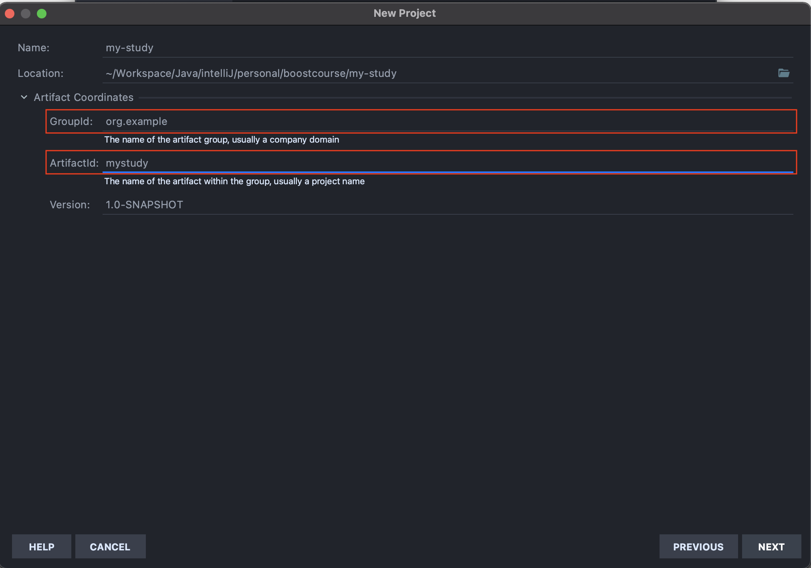

#### 최초 작성일 : 2021.08.01(일)

# Boostcourse Java Back-end 과정 학습

여기서는 Boostcourse Java Back-end 개발 학습을 진행한다.

## 학습 환경

1. OS : MacOS
2. JDK : Oracle JDK 1.8
4. Build Tools : Maven
5. Database : MySQL
6. IDE: IntelliJ IDEA Ultimate

## Maven이란?

1. Maven은 지금까지 애플리케이션을 개발하기 위해 반복적으로 진행해왔던 작업들을 지원하기 위하여 등장한 도구이다.
2. Maven을 사용하면 `빌드(Build), 패키징, 문서화, 테스트와 테스트 리포팅, git, 의존성관리, svn등과 같은 형상관리서버와 연동(SCMs), 배포` 등의 작업을 손쉽게 할 수 있다.
3. `CoC(Convention over Configuration)`
    - CoC란 일종의 관습을 말하는데, 예를 들자면 프로그램의 소스파일은 어떤 위치에 있어야 하고, 소스가 컴파일된 파일들은 어떤 위치에 있어야 하고 등을 미리 정해 놓은 것이다.
    - 이 말은 관습에 이미 익숙한 사용자는 쉽게 Maven을 사용할 수 있는데, 관습에 익숙하지 않은 사용자는 이러한 제약사항에 대해서 심한 거부감을 느낄 수 있다.

### Maven의 이점

1. 가장 큰 장점 중에는 편리한 의존성 라이브러리 관리가 있다.
    - Maven을 사용하면 `설정 파일(pom.xml)`에 몇 줄 적어줌으로써 직접 다운로드 받거나 하는 것을 하지 않아도 라이브러리를 사용할 수 있다.
2. 모든 개발자가 일관된 방식으로 빌드를 수행할 수 있다.
3. 또한 다양한 플러그인을 제공해줘서, 굉장히 많은 일들을 자동화시킬 수 있다.

### Maven 설정 파일 알아보기

1. `Archetype`을 이용하여 Maven 기반 프로젝트를 생성할 경우 생성된 프로젝트 하위에 다음과 같이 `pom.xml` 파일이 생성된다.

```xml

<project xmlns="http://maven.apache.org/POM/4.0.0"
         xmlns:xsi="http://www.w3.org/2001/XMLSchema-instance"
         xsi:schemaLocation="http://maven.apache.org/POM/4.0.0 
                             http://maven.apache.org/maven-v4_0_0.xsd">
    <modelVersion>4.0.0</modelVersion>
    <groupId>kr.or.connect</groupId>
    <artifactId>examples</artifactId>
    <packaging>jar</packaging>
    <version>1.0-SNAPSHOT</version>
    <name>mysample</name>
    <url>http://maven.apache.org</url>
    <dependencies>
        <dependency>
            <groupId>junit</groupId>
            <artifactId>junit</artifactId>
            <version>3.8.1</version>
            <scope>test</scope>
        </dependency>
    </dependencies>
</project>

```

2. 각 태그의 의미
    - project: pom.xml 파일의 최상위 루트 엘리먼트(Root Element).
    - modelVersion: POM model의 버전.
    - groupId: 프로젝트를 생성하는 조직의 고유 아이디.
        - 일반적으로 도메인 이름을 거꾸로 적음
    - artifactId: 해당 프로젝트에 의하여 생성되는 Artifact의 고유 아이디.
        - Maven을 이용하여 pom.xml을 빌드할 경우 다음과 같이 `{artifactid}-{version}.{packaging}`의 규칙으로 Artifact가 생성된다.
        - 위 예제 코드의 경우 examples-1.0-SNAPSHOT.jar Artifact 파일이 생성될 것이다.
    - packaging: 해당 프로젝트를 어떤 형태로 packaging 할 것인지 결정한다.
        - jar, war, ear 등
    - version: 프로젝트의 현재 버전.
        - 추후 살펴보겠지만 프로젝트가 개발 중일 때는 SNAPSHOT을 접미사로 사용한다.
    - name: 프로젝트의 이름.
    - url: 프로젝트 사이트가 있다면 사이트 URL을 등록하는 것이 가능하다.
    - dependencies:  Dependency Management 기능의 핵심이며, 해당 엘리먼트 안에 필요한 라이브러리를 지정해서 사용한다.

## Maven 프로젝트 생성

1. IntelliJ에서 New Project 선택
   
2. `Maven` 선택, `org.apache.maven.archetypes:maven-archetype-webapp` 선택 후 Next 버튼 클릭
   
3. `GroupId`, `ArtifactId`, `Version` 설정 후 Next 버튼 클릭
   
    - GroupId는 보통 프로젝트를 진행하는 회사나 팀의 도메인 이름을 거꾸로 적는다.
    - ArtifactId는 해당 프로젝트의 이름을 적는다.
    - Version은 보통 기본값(1.0-SNAPSHOT)으로 설정한다.
    - 여기서는 언급되지 않지만 `Package`라는 것이 있는데, 이는 GroupId와 ActifactId가 조합된 형태를 가진다.
4. Finish 버튼 클릭
   

### Maven 프로젝트 디렉토리 구조

1. Maven 프로젝트가 생성된 프로젝트의 디렉토리 구조는 다음과 같다.
   
    - Maven으로 생성된 프로젝트의 경우 자바 소스는 `src/main/java` 폴더에 생성된다.
    - 웹 어플리케이션과 관련된 HTML, CSS, Javascript 등은 `src/main/webapp` 폴더에서 작성해야 한다.

## Servlet이란?

1. WAS에서 동작하는 JAVA 클래스이며, 자바 웹 어플리케이션의 구성요소 중 동적인 처리를 하는 프로그램의 역할을 한다.
    - 자바 웹 어플리케이션 디렉토리 구조
      
2. Servlet 구현시에는 `HttpServlet` 클래스를 상속받아야 한다.

### Servlet 작성 방법

1. Servlet 3.0 Spec 이상에서 사용하는 방법
    - `web.xml` 파일을 사용하지 않는다.
    - 자바 `애노케이션(Annotation)`을 사용한다.
      ```java
      @WebServlet("/hello")
      public class HelloServlet extends HttpServlet {
            // code ...
      }
      ```
2. Servlet 3.0 spec미만에서 사용하는 방법
    - Servlet을 등록할 때 `web.xml` 파일에 등록한다.
      ```xml
      <!-- web.xml 내용 일부 -->
      <servlet>
        <description></description>
        <display-name>HelloServlet</display-name>
        <servlet-name>HelloServlet</servlet-name>
        <servlet-class>example.servlet.HelloServlet</servlet-class>
      </servlet>
      <servlet-mapping>
        <servlet-name>HelloServlet</servlet-name>
        <url-pattern>/hello</url-pattern>
      </servlet-mapping>
      <!-- web.xml 내용 일부 -->
      ```

### Servlet 생명주기(Life Cycle)


1. WAS는 서블릿 요청을 받으면 해당 서블릿이 메모리에 있는지 확인한다.
2. 만약, 메모리에 없으면, 해당 서블릿을 메모리에 올린다.
    - `생성자` 호출
        - 이후에는 호출하지 않는다.
    - `init()` 메소드 호출
        - 이후에는 호출하지 않는다.
    - `service()` 메소드 호출
        - 서블릿 호출시마다 호출된다.
        - 해당 서블릿에서 service() 메소드를 오버라이드 하지 않았다면, 부모 클래스인 HttpServlet의 service() 메소드가 동작한다.
        - HttpServlet의 service() 메소드는 `템플릿 메소드 패턴`으로 구현되어 있다.
            - 클라이언트의 요청이 GET일 경우에는 자신이 가지고 있는 `doGet()` 메소드를 호출
            - 클라이언트의 요청이 POST일 경우에는 자신이 가지고 있는 `doPost()` 메소드를 호출
3. WAS가 종료되거나, 웹 어플리케이션이 새롭게 갱신될 경우 해당 서블릿은 메모리에서 사라진다.
    - `destroy()` 메소드 실행

## Request(요청), Response(응답) 객체

### 요청과 응답

1. WAS는 웹 브라우저로부터 Servlet 요청을 받으면, 요청할 때 가지고 있는 정보를 `HttpServletRequest` 객체를 생성하여 저장한다.
2. 또한, 웹 브라우저로 응답을 보낼 때 사용하기 위해 `HttpServletResponse` 객체를 생성한다.
3. 이렇게 생성된 `HttpServletRequest`, `HttpServletResponse` 객체를 서블릿에게 전달한다.
   

### HttpServletRequest

1. HTTP 프로토콜의 요청(Request) 정보를 서블릿에게 전달하기 위한 목적으로 사용된다.
2. `헤더 정보, 파라미터, 쿠키, URI, URL 등`의 정보를 읽어 들이는 메소드를 가지고 있다.
3. 요청 Body의 Stream을 읽어 들이는 메소드를 가지고 있다.

### HttpServletResponse

1. WAS는 어떤 클라이언트가 요청을 보냈는지 알고 있고, 해당 클라이언트에게 응답을 보내기 위해 zHttpServletResponse 객체를 생성해서 서블릿에 전달한다.
2. 서블릿은 해당 객체를 사용하여 `Content-Type, 응답 코드, 응답 메시지 등`을 전송한다.